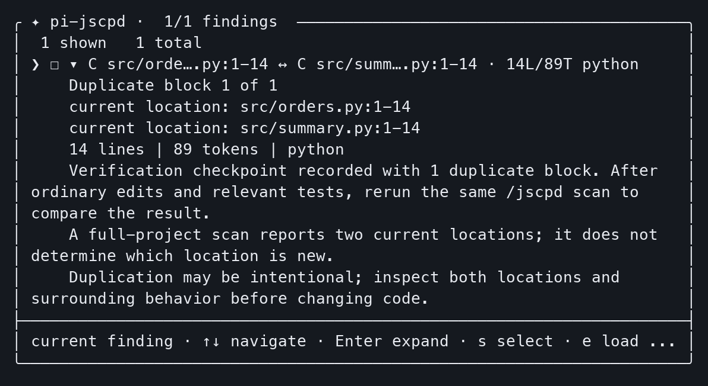

# pi-jscpd

[](https://github.com/revazi/pi-jscpd/actions/workflows/ci.yml)
[](https://www.npmjs.com/package/pi-jscpd)
[](https://www.npmjs.com/package/pi-jscpd)
[](./LICENSE)
[](https://github.com/revazi/pi-jscpd/issues)

A quiet, read-only duplication guardrail for the
[Pi coding agent](https://github.com/earendil-works/pi), powered by
[jscpd](https://github.com/kucherenko/jscpd).

`pi-jscpd` detects duplicate blocks introduced during a Pi session, shows both
locations, and helps you inspect, refactor, test, and verify the result. jscpd
remains the source of truth for tokenization, clone detection, supported
languages, and statistics.

| 🤫 Quiet | 🧭 Advisory | 🌍 Polyglot | 🛟 Fail open |
| --- | --- | --- | --- |
| Clean checks stay out of the model | Never blocks a write or edits source | Uses jscpd’s languages, not a JS-only parser | A missing analyzer never breaks Pi |

## 📦 Install

```sh
pi install npm:pi-jscpd
```

`pi-jscpd` includes jscpd and its on-demand agent skill, so there is no
separate analyzer setup or runtime download. It prefers a compatible project or
`PATH` installation and otherwise uses its bundled analyzer.

Start (or restart) Pi in your project, check readiness, then scan a directory
that exists in your project:

```text
/jscpd status
/jscpd scan src
```

No extension configuration is required. A scoped scan finds matches only within
its targets; use `/jscpd scan` to include the whole project. If no compatible
binary is available, the extension stays dormant and Pi continues normally;
status explains how to recover.

In TUI sessions, the extension performs one best-effort, metadata-only npm check
and shows a warning only when a newer `pi-jscpd` release is available. The check
is bounded to 1.5 seconds, never sends project data, and never downloads or
installs package content. Set `PI_JSCPD_DISABLE_UPDATE_NOTICE=1` (or run Pi
offline) to disable it.

## ⌨️ Usage

Run `/jscpd` to open the interactive overview. Opening it shows status only; it
never starts an implicit scan.

| Command | Purpose |
| --- | --- |
| `/jscpd` | Open the responsive overview |
| `/jscpd changed` | Show unacknowledged duplication introduced this session |
| `/jscpd scan` | Scan the whole project |
| `/jscpd scan src tests` | Scan specific in-project files or directories |
| `/jscpd status` | Show binary, configuration, mode, and last-check status |
| `/jscpd off` | Disable scans for the current session |
| `/jscpd on` | Re-enable scans for the current session |
| `/jscpd help` | Show command help |

Pi can use the same operations through the `jscpd_run` tool:

```json
{
  "command": "scan",
  "args": ["src"]
}
```

Supported tool commands are `scan`, `changed`, `status`, `off`, `on`, and
`help`. In TUI mode, tool calls use a compact native transcript view for clean,
findings, unavailable, timeout, cancellation, status, and session-control
results. Expanding a result shows only its bounded public terminal presentation;
it never reveals analyzer output, temporary paths, source fragments, or the
overlay-only finding cache.

In TUI mode, `/jscpd ` provides subcommand autocomplete with labels and
descriptions; selecting `scan` leaves the editor ready for an optional target.

The package also exposes `/skill:jscpd`. Pi advertises only the skill's concise
description at startup and loads its full workflow guidance on demand when a
duplication task matches or the user invokes the skill command. The extension
and `jscpd_run` tool remain usable when skills are disabled.

For short walkthroughs, see [clean scans, new session duplication, and intentional
duplication](docs/adoption.md). A finding is a reason to inspect, not permission
to refactor.

## 📊 Benchmarks

Real **`pi-jscpd`** `/jscpd scan` on isolated Pi 0.85.1, packaged jscpd `5.1.2`.
Full-tree snapshots, not session findings and not a quality ranking. Median of
three fresh host processes on macOS arm64 / Node 24.12.0, 2026-09-17.

| | Project | Version | Outcome | Blocks | Dup. lines | `/jscpd scan` |
| --- | --- | --- | --- | ---: | ---: | ---: |
| ⚡ | [Vite](https://github.com/vitejs/vite) | [v8.3.0](https://github.com/vitejs/vite/tree/434e8e9495436a60789f2b588a04a6a24a3d1661) | Findings | 524 | 5.91% | 520 ms |
| 🛟 | [React](https://github.com/facebook/react) | [v19.3.0](https://github.com/facebook/react/tree/1d34f91dfde6bba84d08b683aaba164c7194dacb) | Fail-open | — | — | 2.68 s |
| ⚡ | [Vue](https://github.com/vuejs/core) | [v3.5.43](https://github.com/vuejs/core/tree/5be58b4c475c1d14b4abacbfeda610394a0ee4e5) | Findings | 805 | 6.71% | 417 ms |
| 🛟 | [Svelte](https://github.com/sveltejs/svelte) | [svelte@5.57.0](https://github.com/sveltejs/svelte/tree/7bc0a70fe64dbb3fa3848b741963f31d1e10a8dc) | Fail-open | — | — | 808 ms |
| ⚡ | [Express](https://github.com/expressjs/express) | [v5.2.1](https://github.com/expressjs/express/tree/dbac741a49a5a64336b70c06e85c2e2706e36336) | Findings | 274 | 11.19% | 152 ms |
| ⏱️ | [Prettier](https://github.com/prettier/prettier) | [3.9.8](https://github.com/prettier/prettier/tree/4f2ab6765d7cb29408a2abdac75d023d64d44107) | Findings | 981 | 4.89% | 1.23 s |

⚡ under 1 s · ⏱️ about 1 s · 🛟 fail-open (invalid report, Pi kept running).
Version links open the exact scanned commit. Method and sample times:
[public framework snapshots](docs/benchmarks.md). Scheduled refresh:
[#111](https://github.com/revazi/pi-jscpd/issues/111).

## 🔄 How session checks work

At session start, the extension captures one bounded, in-memory project baseline.
It then tracks successful writes and edits made through Pi's built-in `write`
and `edit` tools.

After Pi settles, one coalesced background check compares the current project
with the baseline:

- clean checks stay out of model context;
- failures remain advisory and available through `/jscpd status`;
- new duplicate blocks are reported with both locations;
- existing repository duplication is omitted from changed-only results; and
- actionable automatic findings never trigger a surprise model turn.

Displayed findings are acknowledged for the active conversation branch so the
same unchanged block is not repeatedly reported. Baselines, source bytes,
verification checkpoints, and reports are never persisted.

Manual edits, shell commands, custom mutation tools, deletes, and renames are not
attributed because Pi does not provide a stable structured file list for them.
Use `/jscpd scan` when changes happened outside built-in `write` or `edit`.

## 🖥️ Interactive overview



*Real Pi TUI, disposable synthetic project, explicit project scan and Enter to
expand. Monochrome terminal-cell capture cropped to the overlay; no mock results.
This is current duplication, not a session-delta example.
[Capture details and text alternative](docs/adoption.md#visual-provenance).*

Bare `/jscpd` opens a status-first, Fallow-style bounded TUI with:

- a framed overview of mode, binary, configuration, last check, and explicit
  changed/project scan actions;
- a searchable, scrollable findings navigator that retains up to 100 findings,
  initially shows 10, and reveals the next 10 with `L` or by navigating past the
  last shown row—without rescanning or changing configuration;
- both duplicate locations, size, format, session relationship, inline detail,
  verification, and omission/ambiguity context;
- `j`/`k`, arrows, Home/End, paging, expand/collapse, search, and multi-selection
  controls consistent with Pi Fallow's navigator; and
- a bounded `e`/`a` handoff that closes the overlay and loads selected findings
  into Pi's editor for user review.

The extra overlay cache is in-memory and TUI-only. `maxFindings` still caps
model/tool and explicit-command output, and cached findings are not added to
persisted session state or acknowledgement records. The editor handoff never
submits a prompt. The overview never edits source, writes jscpd configuration,
runs project tests, or refactors automatically. In RPC, JSON, and print modes,
explicit subcommands remain available and the bare command uses a bounded
non-interactive fallback.

## ⚙️ Configuration

Project configuration is optional:

```text
.pi/jscpd-guardrail.json
```

Use `.pi/jscpd-guardrail.local.json` for an ignored local override. Configuration
is read only after Pi trusts the project.

```json
{
  "enabled": true,
  "timeoutMs": 30000,
  "maxFindings": 10,
  "fallowCoexistence": "auto"
}
```

| Setting | Default | Allowed values |
| --- | ---: | --- |
| `enabled` | `true` | Boolean |
| `timeoutMs` | `30000` | Integer from `100` to `300000` |
| `maxFindings` | `10` | Integer from `1` to `100` |
| `fallowCoexistence` | `auto` | `auto`, `on-demand`, or `allow` |

Clone thresholds, formats, ignore rules, and other detection policy belong in
jscpd's normal configuration, such as `.jscpd.json` or package-level jscpd
settings. The extension does not maintain a parallel clone policy.

## 🤝 Fallow coexistence

| Choose | When it fits |
| --- | --- |
| `pi-jscpd` | Focused polyglot duplicate-block review, session deltas, or reuse of existing jscpd detection/CI policy |
| Pi Fallow | Broader JavaScript/TypeScript codebase analysis, including duplication, dead code, complexity, and related checks |
| Both | Fallow's broader checks plus scoped jscpd analysis where its formats or existing policy add value; avoid checking the same duplication scope twice without a reason |

Neither replaces the other's full workflow or your repository's tests and CI
policy. Pi Fallow can also detect duplication. With the default `auto` policy,
`pi-jscpd` conservatively detects supported signs of active Fallow duplication
analysis and moves automatic jscpd checks to on-demand mode to avoid duplicate
warnings.

Explicit `/jscpd changed`, project scans, and scoped scans remain available. Set
`fallowCoexistence` to `allow` when both automatic analyzers are intentional, or
`on-demand` to disable automatic jscpd checks explicitly.

See [Fallow coexistence](docs/fallow-coexistence.md) for the supported signals
and limitations.

## 🔒 Safety and privacy

- Advisory and read-only by default.
- Never downloads packages at runtime or mutates source.
- Invokes binaries with argument arrays, never a shell command string.
- Keeps reports in restrictive temporary directories and removes them after
  success, failure, timeout, cancellation, or shutdown.
- Bounds process time, output, report size, findings, paths, and persisted state.
- Omits source fragments, raw child output, temporary paths, and internal
  fingerprints from results.
- Reads extension configuration only for trusted projects.
- Fails open so analyzer problems do not break the Pi session.

## ✅ Requirements

| Component | Supported |
| --- | --- |
| Node.js | `>=22.19.0 <23` or `>=24 <25` |
| Pi packages | `>=0.84.4 <0.85.0` or `>=0.85.1 <0.86.0` (tested with `0.85.1`) |
| TypeBox | `>=1.3.7 <2` |
| Effect | Exact reviewed `3.22.1` runtime foundation |
| jscpd | Bundled `5.1.2`; compatible project-local or `PATH` v5 installations are preferred |

See the [compatibility policy](docs/compatibility.md) for the exact tested
fixtures and certification matrix.

## 💬 Share feedback

Tried a scan or the onboarding examples? Use the optional [validation and adoption
feedback form](https://github.com/revazi/pi-jscpd/issues/new?template=adoption-feedback.yml).
It asks for version information and coarse size, latency, and finding-review
buckets; “Unknown” and “Not tested” are welcome. No new scan is required.

Submissions are public and manual—no telemetry or automatic submission is added.
Do not include credentials, private paths, source fragments, raw reports, raw
child output, terminal captures, or account/repository identifiers. For a
reproducible defect, prefer the [bug report](https://github.com/revazi/pi-jscpd/issues/new?template=bug-report.yml);
report vulnerabilities [privately](SECURITY.md).

## 🧩 More Pi packages by Revaz

| Package | Purpose |
| --- | --- |
| [`pi-fallow`](https://www.npmjs.com/package/pi-fallow) | Fallow codebase intelligence for Pi |
| [`pi-reads`](https://www.npmjs.com/package/pi-reads) | Source capture, cited reading, Obsidian, EPUB, PDF, and Kindle workflows |
| [`pi-career`](https://www.npmjs.com/package/pi-career) | Deterministic resume and career workflows |
| [`pi-tmux-orchestrator`](https://www.npmjs.com/package/pi-tmux-orchestrator) | Multi-agent coordination in tmux |
| [`@tasklight/pi-tasklight`](https://www.npmjs.com/package/@tasklight/pi-tasklight) | Tasklight notifications for Pi |

## 🛠️ Development

```sh
npm ci --ignore-scripts
npm run format
npm run docs:check
npm run repo:hygiene
npm run check
npm run pack:certify
```

`npm run check` includes the Effect runtime-boundary architecture gate.
`npm run release:check` runs the complete documentation, hygiene, compatibility,
architecture, test, and packed-artifact release gate. Tests are network-free and
use deterministic fake jscpd executables and Effect layers.
The repository-owned `.jscpd.json` excludes dependency/build
artifacts, caches, source maps, snapshots, archives, and common package-manager
lockfiles while continuing to analyze `src`, `test`, scripts, documentation, and
workflow files.

Useful documentation:

- [Public framework snapshots](docs/benchmarks.md)
- [First scans and safe finding review](docs/adoption.md)
- [Effect architecture and conformance](docs/effect-architecture.md)
- [Automatic checkpoint lifecycle](docs/automatic-checkpoint.md)
- [`/jscpd` overlay contract](docs/overlay-interaction.md)
- [Fallow coexistence](docs/fallow-coexistence.md)
- [Compatibility and packed-artifact certification](docs/compatibility.md)
- [Real-project validation evidence](docs/m8-validation.md)
- [Release preparation and publication policy](docs/release.md)
- [Contributing](CONTRIBUTING.md)
- [Security policy](SECURITY.md)
- [Changelog](CHANGELOG.md)

## 📄 License

[MIT](./LICENSE) © 2026 Revaz Zakalashvili
